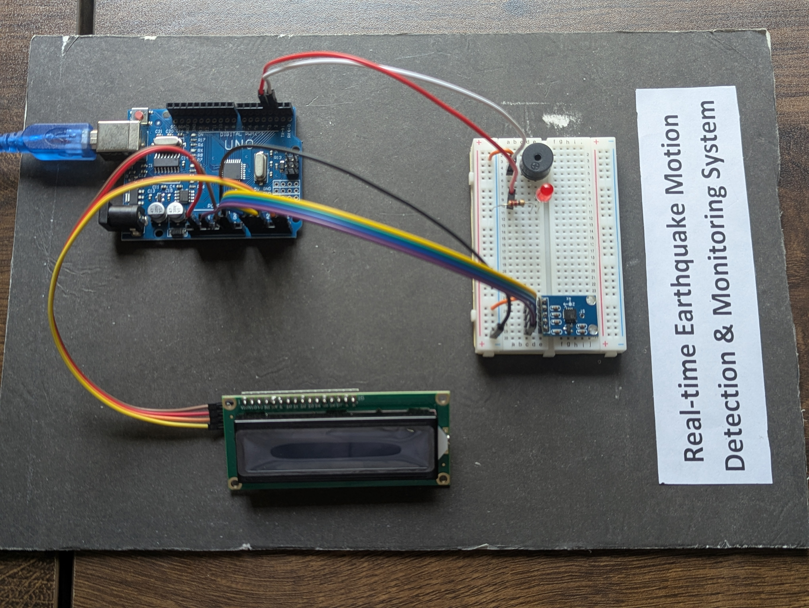
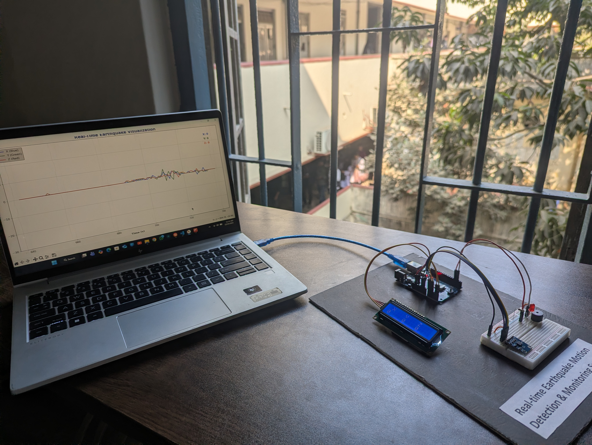

# Earthquake Detection & Real-Time Visualization System

A sensor-based academic project that detects seismic vibration using an
accelerometer and visualizes the incoming data in real time through an
animated Python plot.

## Overview

This project explores how low-cost sensor hardware can be combined with
Python to detect and visualize physical vibration in real time — a
simplified, educational take on the kind of sensing systems used in
seismic monitoring.

An ADXL335 accelerometer is wired to an Arduino Uno to continuously
measure acceleration along three axes (X, Y, Z). The Arduino evaluates
incoming sensor readings against a defined threshold; when vibration
exceeds that threshold, it triggers a buzzer alert and flags the event
over serial communication. A Python script on the connected computer
reads this serial data stream in real time and renders it as a live,
continuously updating animated graph using Matplotlib.

The project was built as part of a microcontroller systems course and
reflects an end-to-end integration of hardware sensing, embedded logic,
and real-time software visualization.

## Features

- Real-time 3-axis (X, Y, Z) vibration monitoring using an ADXL335 accelerometer
- Automatic buzzer alert triggered on threshold breach
- Live animated graph rendering incoming sensor data every 100ms
- Serial communication pipeline between Arduino and Python

## Tech Stack

Arduino Uno · ADXL335 Accelerometer · Python · Matplotlib · Serial Communication (PySerial)

## Project in Action

**Hardware Setup**

*ADXL335 accelerometer wired to Arduino Uno for real-time vibration sensing*

**Real-Time Visualization Output**

*Live-updating vibration graph rendered in Python as sensor data streams in*

## How It Works

1. The Arduino continuously reads accelerometer values and sends them over serial
2. A Python script reads the incoming serial stream in real time
3. Matplotlib animates the incoming X, Y, Z values as a live-updating graph
4. On threshold breach, the buzzer triggers and the graph flags the alert

## Challenges & Learnings

Working across the hardware-software boundary required getting the serial
communication protocol right on both ends — matching baud rates, handling
inconsistent or partial serial reads, and keeping the Python visualization
responsive without lag. It was a practical, hands-on introduction to how
embedded systems and higher-level software need to stay in sync in real time.

## Acknowledgment

The real-time visualization script was adapted from an open-source
reference and customized for this project; hardware integration, sensor
wiring, and Arduino-side logic were implemented independently.
